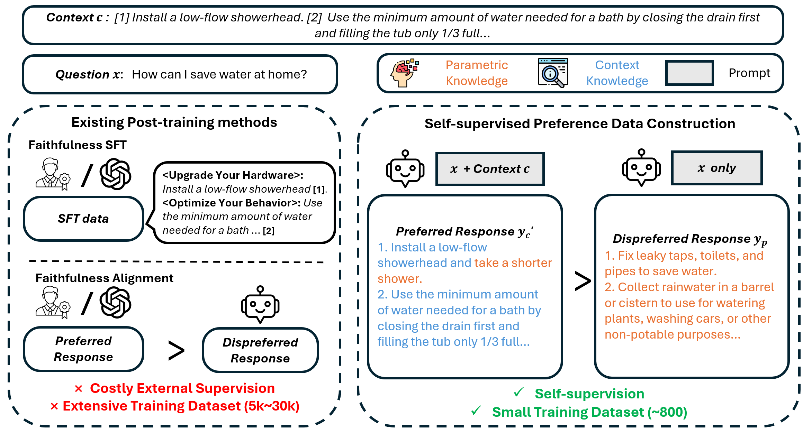

# <center>SSFO: Self-Supervised Faithfulness Optimization for Retrieval-Augmented Generationn</center>



This project implements Self-Supervised Faithfulness Optimization (SSFO), a lightweight, self-supervised post-training approach capable of significantly enhancing LLM faithfulness using only minutes of additional training on a few hundred examples.
 Our key insight is that faithfulness alignment can be achieved through contrastive self-guidance without the introduction of extra supervision.
 SSFO provides a near out-of-the-box experience, markedly outperforming decoding strategy-based and post-training based methods.

## Requirements
- Llamafactory
- deepspeed
- vllm
- rouge_score
- sacrebleu
 


## Usage
The scripts.sh script is used to run data preparation, training, and evaluation phases. It requires three arguments: the model path, experiment name, and chat template name.
```shell
$bash scripts.sh /home/XiaqiangTang/.cache/Llama-3.1-8B-Instruct test_llama3_1_tang llama3
Model path: /home/XiaqiangTang/.cache/Llama-3.1-8B-Instruct
Model name: test_llama3_1_tang
Template: llama3
Dataset dir: test_llama3_1_tang_DFO_data
Check out the logs at logs/test_llama3_1_tang_run.log
-------------------- Creating DFO data for model test_llama3_1_tang --------------------
DFO data created at test_llama3_1_tang_DFO_data
-------------------- Training DFO model test_llama3_1_tang --------------------
Training completed. Model saved at saves/test_llama3_1_tang
-------------------- Starting evaluation --------------------
Evaluating Llama-3.1-8B-Instruct on dataset nqopen
Evaluating test_llama3_1_tang on dataset nqopen
Evaluating Llama-3.1-8B-Instruct on dataset nqswap
Evaluating test_llama3_1_tang on dataset nqswap
Evaluating Llama-3.1-8B-Instruct on dataset memo-trap
Evaluating test_llama3_1_tang on dataset memo-trap
-------------------- Evaluation results --------------------
Dataset              | Base model Subspan_EM     | DFO model Subspan_EM     
---------------------+---------------------------+--------------------------
nqopen               | 79.10%                    | 81.54%                   
nqswap               | 57.10%                    | 75.54%                   
memo-trap            | 62.86%                    | 69.52% 
DuReader             | 78.48%                    | 81.51%               
```


## Detailed Results from Evaluation

### Llama 3 instruct
| Dataset   | Base model Subspan_EM | DFO model Subspan_EM |
|-----------|-----------------------|----------------------|
| nqopen    | 80.23%                | 84.22%               |
| nqswap    | 66.94%                | 79.12%               |
| memo-trap | 73.22%                | 76.09%               |
| DuReader  | 78.26%                | 81.93%               |

### Llama 3.1 Instruct
| Dataset   | Base model Subspan_EM | DFO model Subspan_EM |
|-----------|-----------------------|----------------------|
| nqopen    | 78.83%                | 81.85%               |
| nqswap    | 57.10%                | 75.54%               |
| memo-trap | 62.86%                | 69.52%               |
| DuReader  | 78.48%                | 81.51%               |

### Qwen2.5-7B-Instruct
| Dataset   | Base model Subspan_EM | DFO model Subspan_EM |
|-----------|-----------------------|----------------------|
| nqopen    | 82.45%                | 86.37%               |
| nqswap    | 76.99%                | 86.15%               |
| memo-trap | 53.80%                | 60.11%               |
| DuReader  | 82.29%                | 85.04%               |


